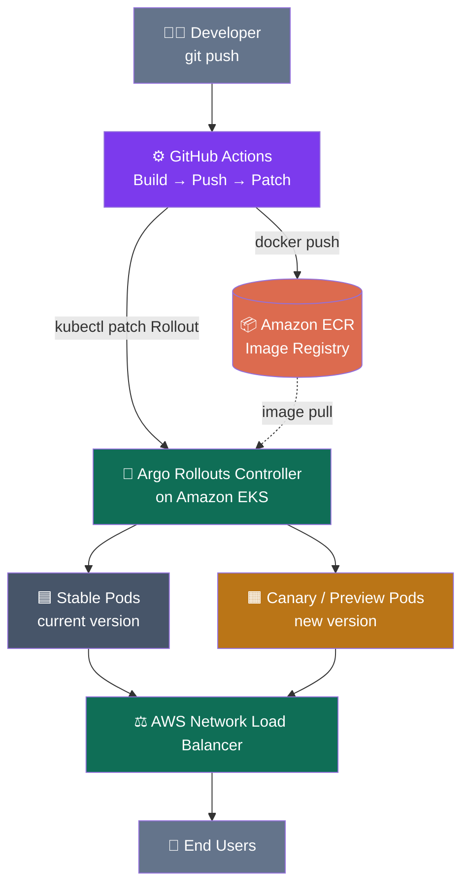
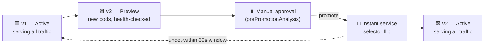
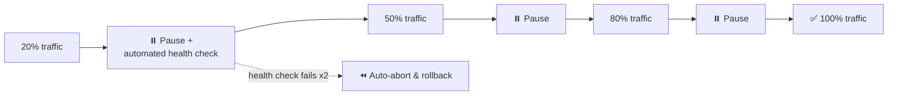

# CI/CD Pipeline with Blue/Green &amp; Canary Deployments


A production-style CI/CD pipeline that ships a containerized app to **Amazon EKS** using
**Argo Rollouts**, with a real choice of **Blue/Green** or **Canary** deployment strategy
including automated health checks, one-command promote/rollback, and zero long-lived AWS
credentials (GitHub OIDC).

 **Push to `main` → image is built and pushed to ECR → Argo Rollouts shifts live traffic to
 the new version, gradually (canary) or with a single manual promotion (blue/green) →
 rollback in one command if anything looks wrong.**


## Table of Contents

- [Architecture](#architecture)
- [Tech Stack](#tech-stack)
- [Screenshots](#screenshots)
- [Project Structure](#project-structure)
- [Prerequisites](#prerequisites)
- [Setup](#setup)
- [How the Deployments Work](#how-the-deployments-work)
- [Useful Commands](#useful-commands)

## Architecture



**Blue/Green promotion flow:**



**Canary progressive rollout flow:**


## Tech Stack

| Layer | Tool |
|---|---|
| Cloud provider | AWS (EKS, ECR, IAM, NLB) |
| CI/CD | GitHub Actions (OIDC no static AWS keys) |
| Deployment controller | Argo Rollouts |
| Container runtime | Docker |
| App | Node.js + Express (demo app) |
| Cluster provisioning | eksctl |

## Screenshots

### GitHub Actions pipeline — successful run


### App running — v1 (blue / stable)


### Blue/Green — after promotion (instant traffic switch)


### Canary — traffic weight shifting step by step


### Argo Rollouts dashboard — live stable vs canary split


## Project Structure

```
bluegreen-canary-demo/
├── app/
│   ├── server.js              # demo Node.js app (shows version + color)
│   ├── package.json
│   ├── Dockerfile
│   └── .dockerignore
├── k8s/
│   ├── service.yaml            # public LB service + stable/canary internal services
│   ├── analysis-template.yaml  # automated HTTP health check used during rollout
│   ├── rollout-bluegreen.yaml  # Blue/Green strategy Rollout
│   └── rollout-canary.yaml     # Canary strategy Rollout
├── .github/workflows/
│   └── deploy.yml              # build → push to ECR → patch Rollout on EKS
└── README.md
```
## Prerequisites

- AWS account with permissions to create EKS/ECR/IAM resources
- GitHub account
- Installed locally: `aws` CLI v2, `kubectl`, `eksctl`, `docker`, `git`
- `kubectl argo rollouts` plugin ([install guide](https://argoproj.github.io/argo-rollouts/installation/#kubectl-plugin-installation))

## Setup

This README covers the short version. **For every command and console click explained in
full, see [`IMPLEMENTATION-GUIDE.md`](./IMPLEMENTATION-GUIDE.md) in this repo.**

1. **Create the ECR repository**
   ```bash
   aws ecr create-repository --repository-name bluegreen-canary-demo --region <YOUR_REGION>
   ```
2. **Create the EKS cluster**
   ```bash
   eksctl create cluster --name bluegreen-canary-demo --region <YOUR_REGION> \
     --node-type t3.medium --nodes 2 --managed
   ```
3. **Install Argo Rollouts**
   ```bash
   kubectl create namespace argo-rollouts
   kubectl apply -n argo-rollouts -f https://github.com/argoproj/argo-rollouts/releases/latest/download/install.yaml
   ```
4. **Push the first image and deploy** (pick blue-green or canary)
   ```bash
   docker build -t <ECR_URI>:v1 ./app && docker push <ECR_URI>:v1
   kubectl apply -f k8s/service.yaml
   kubectl apply -f k8s/analysis-template.yaml
   kubectl apply -f k8s/rollout-bluegreen.yaml   # or rollout-canary.yaml
   ```
5. **Give GitHub Actions OIDC access to AWS** — create an IAM OIDC provider, an IAM role
   trusted by your repo, and an EKS access entry so the role can run `kubectl` commands.
   *(Full click-by-click steps in `IMPLEMENTATION-GUIDE.md`, Part 7.)*
6. **Add the repo secret** `AWS_ROLE_ARN` under **Settings → Secrets and variables →
   Actions**.
7. **Push a change** to `app/` on `main` — the pipeline builds, pushes, and triggers the
   rollout automatically.

## How the Deployments Work

**Blue/Green** — the new version comes up fully alongside the old one. You preview it on an
internal `myapp-canary` service before anyone else sees it, then flip all live traffic to it
with a single command. The old version stays alive briefly afterward for an instant rollback.

**Canary** — the new version receives a small slice of live traffic (~20%), automatically
pauses for a health check, then ramps to 50% → 80% → 100% if everything looks healthy. Two
failed health checks trigger an automatic abort and rollback — no human needs to be watching.

## Useful Commands

```bash
kubectl argo rollouts get rollout myapp --watch      # live status
kubectl argo rollouts promote myapp                   # advance one step / end pause
kubectl argo rollouts promote myapp --full            # jump straight to 100%
kubectl argo rollouts abort myapp                      # cancel now, revert to stable
kubectl argo rollouts undo myapp                       # roll back to previous revision
kubectl argo rollouts dashboard                         # web UI at localhost:3100
```


